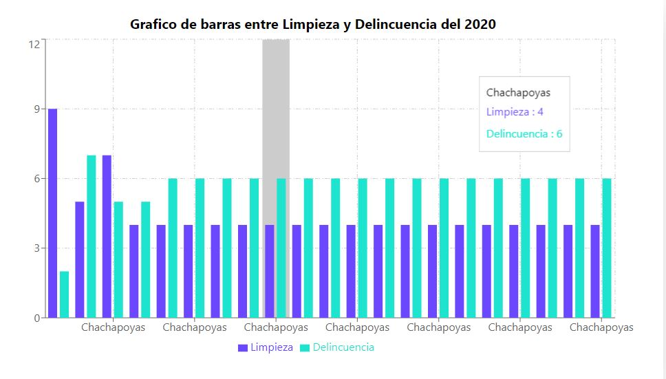

# Limpieza-Delincuencia App Usuario

# Pictures




## Technologies

- React
- Tailwind
- JavaScript: ES6+
- Vite

## Run Locally

### 1. Clone repo

```
$ git https://github.com/jhonntantb/limpieza_delincuencia_user
$ cd limpieza_delincuencia_user
```

### 2. Run Proyect

- Instalar dependencias

```
$ npm i
```

-Iniciar Proyecto

```
$ npm run dev
```

### 3. Support

- Contact Developer [Jhonntan](mailto:Jhonntan.jhonntantb@gmail.com)
